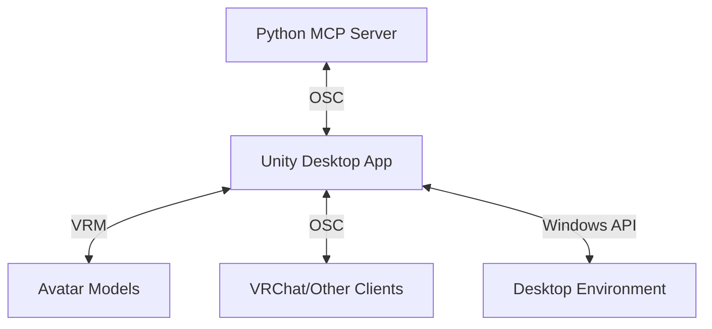

# AvatarMCP Desktop Avatar Architecture

## Overview

AvatarMCP Desktop Avatar is a sophisticated real-time 3D avatar system that brings VRM avatars to your desktop as interactive, semi-transparent overlays. This document provides an in-depth look at the system architecture, components, and integration points.

## System Architecture




## Core Components

### 1. Unity Desktop Application

The Unity-based client application that renders the avatar overlay and handles user interaction.

#### Key Features

- **Transparent Window Management**: Uses Windows API for non-rectangular, click-through windows
- **VRM Runtime**: Loads and renders VRM 1.0 avatars with full skeletal and blend shape support
- **Animation System**: State machine-based animation controller with support for:
  - Full-body IK
  - Facial expressions
  - Gestures and emotes
  - Lip-sync (viseme) support
- **Physics Integration**: Real-time cloth and hair physics simulation
- **Performance Optimization**: LOD (Level of Detail) system and render queue management

### 2. MCP Server (Python)

The central control server that coordinates between various clients and services.

#### Key Features

- **OSC Server**: Handles incoming/outgoing OSC messages
- **Plugin System**: Extensible architecture for adding new functionality
- **State Management**: Maintains avatar state and synchronizes across clients
- **REST API**: Web interface for remote control and monitoring
- **Configuration Management**: Centralized settings and preferences

### 3. Communication Protocol

#### OSC Message Format

```text
/avatar/[category]/[action] [parameters...]
```


#### Core Message Types:

1. **Avatar Control**
   - `/avatar/load [path]` - Load a new VRM avatar
   - `/avatar/unload` - Unload current avatar
   - `/avatar/visibility [0-1]` - Set avatar visibility

2. **Animation**
   - `/avatar/animation/play [name] [loop] [speed]`
   - `/avatar/animation/stop [name]`
   - `/avatar/animation/parameter [name] [value]`

3. **Expressions**
   - `/avatar/expression/set [preset] [value]`
   - `/avatar/expression/blendshape [name] [value]`
   - `/avatar/expression/reset`

4. **Window Control**
   - `/window/position [x] [y]`
   - `/window/size [width] [height]`
   - `/window/opacity [0-1]`
   - `/window/clickthrough [0/1]`
   - `/window/alwaysontop [0/1]`

## Advanced Features

### 1. Multi-Avatar Support
- Multiple independent avatar instances
- Avatar switching and blending
- Avatar mirroring and cloning

### 2. Input Handling
- Mouse and keyboard controls
- Gamepad/controller support
- Touch screen gestures
- Voice command integration

### 3. Performance Optimization
- Dynamic resolution scaling
- Texture and mesh LODs
- CPU/GPU performance profiling
- Background rendering

### 4. Integration Points
- VRChat OSC
- VRM model format
- Web camera input
- Microphone input for voice
- External tracking devices

## Technical Implementation

### Unity Implementation

#### Key Scripts

- `DesktopOverlayManager.cs`: Main controller
- `VRMController.cs`: VRM loading and management
- `OSCService.cs`: OSC communication
- `WindowController.cs`: Window management
- `AnimationController.cs`: Animation state machine
- `ExpressionController.cs`: Facial expressions and blendshapes

#### Shaders

- Custom transparent shaders for proper alpha blending
- Post-processing effects
- Stencil-based masking

### Performance Considerations

1. **Rendering**
   - Command buffer optimizations
   - GPU instancing
   - Texture atlasing

2. **Memory Management**
   - Object pooling
   - Asset bundle loading
   - Garbage collection optimization

3. **Threading**
   - Job system for animations
   - Burst compiler optimizations
   - Async/await patterns

## Security Considerations

1. **VRM Validation**
   - Model sanitization
   - Size and complexity limits
   - Script validation

2. **Network Security**
   - OSC message validation
   - Rate limiting
   - Authentication for remote control

3. **Privacy**
   - Camera/microphone access controls
   - Data collection policies
   - Local storage encryption

## Future Roadmap

### Short-term
- [ ] Basic VRM loading and rendering
- [ ] Transparent window implementation
- [ ] OSC communication
- [ ] Basic animation controls

### Medium-term
- [ ] Advanced expression controls
- [ ] Performance optimizations
- [ ] Plugin system
- [ ] Multi-monitor support

### Long-term
- [ ] AR/VR integration
- [ ] AI-driven animations
- [ ] Cloud sync for settings/avatars
- [ ] Cross-platform support (macOS/Linux)

## Development Setup

### Prerequisites
- Unity 2022.3.11f1 LTS
- Python 3.8+
- Windows 10/11 (for transparent window support)

### Build Process
1. Clone repository
2. Open in Unity
3. Import required packages
4. Build and run

## Contributing

See [CONTRIBUTING.md](CONTRIBUTING.md) for contribution guidelines, code style, and pull request process.

## License

MIT License - See [LICENSE](LICENSE) for details.
