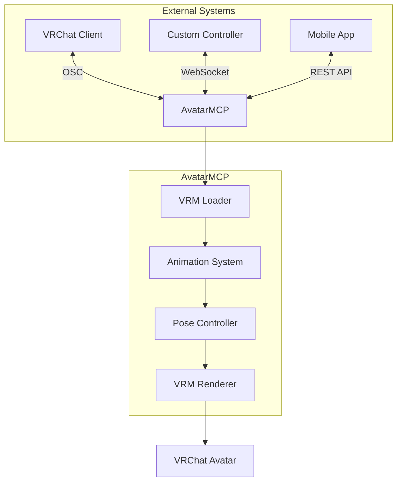

# VRChat Avatar Integration and External Control

## Table of Contents
- [Overview](#overview)
- [VRChat Avatar Requirements](#vrchat-avatar-requirements)
- [Integration Architecture](#integration-architecture)
- [External Control Methods](#external-control-methods)
- [Security Considerations](#security-considerations)
- [Performance Optimization](#performance-optimization)
- [Troubleshooting](#troubleshooting)

## Overview

This document provides comprehensive guidance on integrating VRChat avatars with external control systems using AvatarMCP. It covers the technical specifications, setup procedures, and best practices for creating interactive and responsive avatars.

## VRChat Avatar Requirements

### Supported Avatar Specifications
- **VRM 2.0** (Virtual Reality Model)
  - Must be exported from VRoid Studio or compatible 3D modeling software
  - Should follow VRChat's recommended polygon and texture limits
  - Must include proper humanoid bone structure

### Required Components
1. **BlendShapes**
   - Standard VRChat visemes (A, I, U, E, O, etc.)
   - Common facial expressions (Blink, Joy, Angry, Sorrow, Fun)
   - Custom expressions as needed

2. **Bones**
   - Full humanoid rig following VRChat's specifications
   - Optional: Additional bones for hair, clothing, and accessories

3. **Materials**
   - VRChat-compatible shaders
   - Optimized textures (compressed, power of two dimensions)
   - Proper transparency settings

## Integration Architecture

### System Components



### Data Flow
1. **Input Handling**
   - OSC messages from VRChat
   - WebSocket commands from custom controllers
   - REST API calls from web/mobile interfaces

2. **Processing**
   - Input validation and normalization
   - Animation blending
   - Physics simulation (if applicable)

3. **Output**
   - Bone transformations
   - BlendShape weights
   - Material properties

## External Control Methods

### 1. OSC (Open Sound Control)
**Endpoint**: `/avatar/parameters/{parameter}`

**Supported Parameters**:
- **Gestures**
  - `/avatar/parameters/GestureLeft` (Float: 0-1)
  - `/avatar/parameters/GestureRight` (Float: 0-1)
  
- **Expressions**
  - `/avatar/parameters/Viseme` (Integer: 0-15)
  - `/avatar/parameters/Voice` (Float: 0-1)

**Example**:
```python
import pythonosc.udp_client

osc_client = pythonosc.udp_client.SimpleUDPClient("127.0.0.1", 9000)
osc_client.send_message("/avatar/parameters/GestureLeft", 1.0)  # Fist
```

### 2. WebSocket API
**Endpoint**: `ws://localhost:8765`

**Message Format**:
```json
{
    "command": "update_pose",
    "parameters": {
        "head": {"rotation": [0.1, 0, 0]},
        "left_hand": {"gesture": "point"}
    }
}
```

### 3. MQTT Integration
**Topics**:
- `avatarmcp/{avatar_id}/pose` - Update avatar pose
- `avatarmcp/{avatar_id}/animation` - Control animations
- `avatarmcp/{avatar_id}/expression` - Set facial expressions

**Example**:
```python
import paho.mqtt.client as mqtt

def on_connect(client, userdata, flags, rc):
    client.subscribe("avatarmcp/+/pose")

def on_message(client, userdata, msg):
    print(f"Received message on {msg.topic}")

client = mqtt.Client()
client.on_connect = on_connect
client.on_message = on_message
client.connect("mqtt.example.com", 1883, 60)
client.loop_forever()
```

## Security Considerations

### Authentication
- **OSC**: IP whitelisting
- **WebSocket**: JWT tokens
- **REST API**: OAuth2 with API keys
- **MQTT**: Username/password and TLS

### Rate Limiting
- 60 requests per minute per client
- Burst handling with token bucket algorithm

### Data Validation
- Input sanitization
- Range checking for all parameters
- Schema validation for JSON messages

## Performance Optimization

### Avatar Optimization
- **Polygon Count**: <70,000 triangles
- **Textures**:
  - Diffuse: 2048x2048 max
  - Normal maps: 1024x1024 max
  - Use texture atlases where possible

### Network Optimization
- Message batching
- Delta compression for pose updates
- Binary protocols for high-frequency updates

### Rendering Optimization
- LOD (Level of Detail) systems
- Frustum culling
- Occlusion culling

## Troubleshooting

### Common Issues
1. **Avatar Not Loading**
   - Verify VRM 2.0 compatibility
   - Check console for import errors
   - Ensure all textures are properly referenced

2. **Animation Jitter**
   - Check network latency
   - Reduce update frequency
   - Enable interpolation

3. **Performance Issues**
   - Profile with Unity's Profiler
   - Check for unnecessary Update() calls
   - Optimize shaders and materials

### Debugging Tools
- **Unity Editor**: Frame debugger, profiler
- **Wireshark**: Network traffic analysis
- **Custom Debug Views**: Bone visualization, blend shape weights

## Related Resources
- [VRChat SDK Documentation](https://docs.vrchat.com/)
- [VRM Specification](https://vrm.dev/)
- [OSC Protocol Reference](https://opensoundcontrol.stanford.edu/)
- [MQTT Protocol Specification](https://mqtt.org/specification/)

## Support
For additional assistance, please contact support@avatarmcp.example.com or visit our [community forums](https://community.avatarmcp.example.com).
